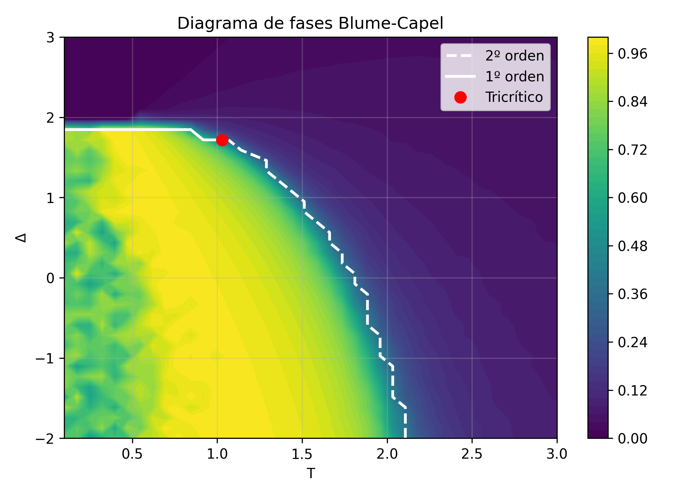
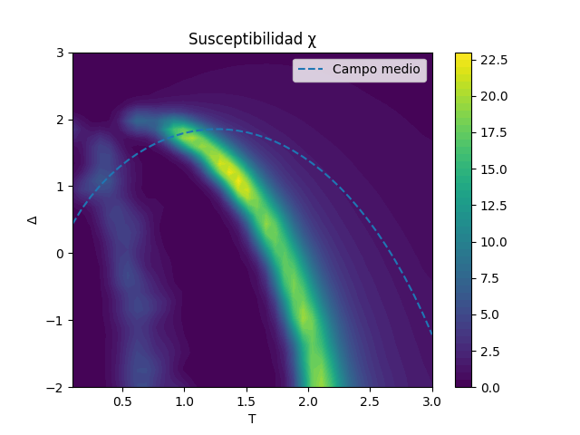
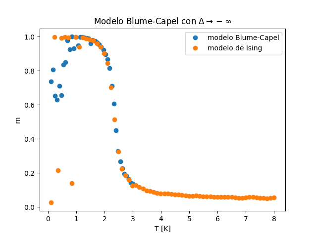

# Blume-Capel Model Monte Carlo Simulation

Implementation of a Monte Carlo simulation of the two-dimensional Blume-Capel model using the Metropolis algorithm.

## Results

### Magnetization and Phase Boundary

Monte Carlo magnetization map as a function of temperature and crystal field parameter Δ. The critical line obtained from mean-field theory is superimposed for comparison.

### Magnetic Susceptibility

Magnetic susceptibility obtained from magnetization fluctuations. Peaks indicate the location of second-order phase transitions.

### Ising Limit Comparison

Comparison between the Blume-Capel model in the limit Δ → −∞ and the two-dimensional Ising model, confirming the expected recovery of Ising behavior.

## Overview

The Blume-Capel model is an extension of the Ising model in which each lattice site can take three possible spin values:

S = {-1, 0, +1}

The Hamiltonian is given by:

H = -J Σ S_i S_j + Δ Σ S_i²

where Δ is the crystal field parameter controlling the density of vacancies.

## Features

- Two-dimensional square lattice
- Periodic boundary conditions
- Metropolis Monte Carlo updates
- Magnetization calculation
- Magnetic susceptibility calculation
- Temperature and crystal field sweeps
- Comparison with mean-field predictions

## Physics Background

This project investigates the phase diagram of the Blume-Capel model, including:

- Ferromagnetic and paramagnetic phases
- Second-order phase transitions
- Tricritical behavior
- Recovery of the Ising model in the limit Δ → -∞

## Implementation

Language: C++

Lattice size: 20 × 20

Algorithm: Metropolis Monte Carlo

Observables:
- Magnetization
- Magnetic susceptibility

## Documentation

A complete description of the theoretical background, numerical implementation and results is available in:

Blume_Capel_Report.pdf

## External Data

The comparison with the Ising model uses precomputed results stored in:

data/ising_results.txt

These data were generated using an independent Monte Carlo implementation of the 2D Ising model.

## Authors

Esther Menéndez Ibáñez

[Nombre de tu compañero]
